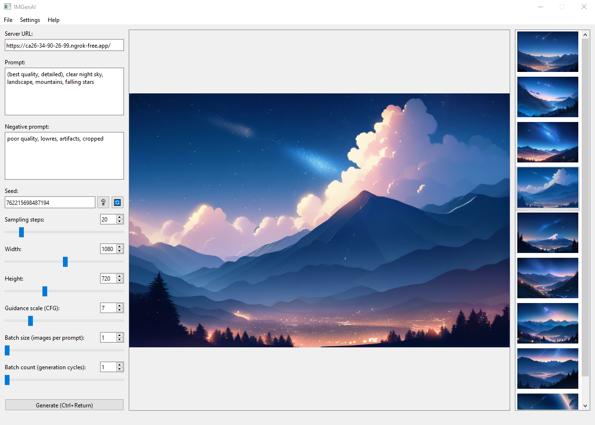

<h1 align="center">IMGenAI by Oderline</h1>

  

## IMGenAI

This is a project for generating images from text prompts with desktop app, powered by PyQt6 and [Diffusers](https://github.com/huggingface/diffusers), running on [Google Colab](https://colab.research.google.com/) VM's.

## Setup server:

#### 1. Save a copy of [this colab notebook](https://colab.research.google.com/drive/11qjb5gWBIqp7JOAZRlTBa_Oj-9r9ttFN?usp=sharing) on your Google Drive.

#### 2. Create secret key "NGROK_AUTHTOKEN" with your [ngrok authtoken](https://dashboard.ngrok.com/get-started/your-authtoken).

#### 3. Select Stable Diffusion model in "Setting up Stable Diffusion pipeline" tab or use [custom text-to-image model](https://huggingface.co/models?pipeline_tag=text-to-image&library=diffusers&sort=trending).

#### 4. Run all cells and wait 'till server run.

#### 5. Copy server's public url to IMGenAI app.

## Setup desktop app:

Instead of building IMGenAI app by yourself, you can download latest [release version](https://github.com/oderline/IMGenAI/releases).

## Setup from source code:

#### Clone repository:

~~~
git clone https://github.com/oderline/IMGenAI
~~~

#### Install python 3.10:

~~~
sudo add-apt-repository ppa:deadsnakes/ppa && sudo apt update
sudo apt install python3.10
~~~

#### Install packages:

~~~
python3.10 -m pip install pyinstaller pyqt6 pyqt6-tools ujson
~~~

## Usage

In the desktop, paste server's public url to "Server URL:" field. Go to configurations and set diffusers model. Then, edit prompt settings for your needs, or load prompt settings from text/image file. Click "Generate" button and wait server's response.
