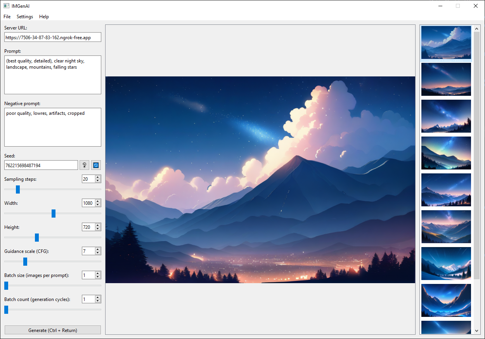

<h1 align="center">IMGenAI by Oderline

(used model: animagine-xl-3.1 by CagliostroLab)

</h1>

IMGenAI - an open source client-server application for AI image generation. The server-side based on Diffusers library. UI for desktop app is written using PyQt.

# Usage

The server side of the program powered by Google Colab to processes POST requests to generate images based on user-specified parameters and return the result back to the user. The client-side application handles user input, validation, and result presentation.

IMGenAI provides a simple prompt configurator that allows users to specify parameters such as prompt, negative prompt, seed and other parameters, image viewer to display generated images, image gallery and some other advanced features. All settings can be edited through the configuration window or manually in the config.ini file.

The prompt configurator contains next settings:

- **Server URL:** the URL of the server-side that will be used to generate images.
- **Prompt:** the main text prompt that describes the desired image.
- **Negative prompt:** a text prompt that describes the image that should not be generated.
- **Seed:** a random seed value that is used to generate the image.
- **Sampling steps:** the number of steps used to generate the image.
- **Width:** the width of the generated image.
- **Height:** the height of the generated image.
- **Guidance scale:** the strength of the image's guidance.
- **Batch size:** the number of images to generate in a single request.
- **Batch count:** the number of batches to generate.

# Setting up IMGenAI

- ### Download desktop app:

    Download latest [release version](https://github.com/oderline/IMGenAI/releases) of IMGenAI app (or it's source code). You can choose either a single-file executable or an archived folder.

- ### Setup python environment (optional):

    __This step is optional and required only if you want to run IMGenAI app from source code.__

    1. Create new virtual environment:
    ~~~
    python -m venv venv
    ~~~

    2. Activate virtual environment:
    ~~~
    .\venv\Scripts\activate.bat
    ~~~

    3. Install client-side dependencies:
    ~~~
    pip install -r requirements.txt
    ~~~

- ### Server-side configuration:

    1. Save a copy of [this colab notebook](https://colab.research.google.com/drive/1PlTCQoYTQsKt1K7N6QINGfQzf5uz4_vJ?usp=sharing) on your Google Drive.

    2. Create secret key "NGROK_AUTHTOKEN" with your [ngrok authtoken](https://dashboard.ngrok.com/get-started/your-authtoken).

    3. Select Stable Diffusion model in "Setting up Stable Diffusion pipeline" tab or use [custom text-to-image model](https://huggingface.co/models?pipeline_tag=text-to-image&library=diffusers&sort=trending).

    4. Run all cells and wait 'till server run.

    5. Copy server's public url to IMGenAI app.

# Future plans

- [x] Add support for multiple models.
- [x] Fix dynamic model switching.
- [ ] Improve prompt configurator.
- [ ] Implement server-side application for any Python-compatible device.
- [ ] Mobile devices support.
- [ ] Improve UI.

# Contributing

Contributions to IMGenAI are welcome! If you find a bug or have a feature request, please open an issue on the [GitHub repository](https://github.com/oderline/IMGenAI). If you would like to contribute code, please fork the repository and submit a pull request.

# Project dependencies:

- ## Server-side:

    | Library | Version (if known) | License | Purpose |
    |---|---|---|---|
    | transformers | | Apache License 2.0 | Natural language processing |
    | diffusers | | Apache License 2.0 | Text-to-image generation |
    | accelerate | | Apache License 2.0 | Machine learning acceleration |
    | torch | | MIT License | PyTorch framework |
    | pyngrok | | MIT License | Ngrok tunneling |
    | flask | | MIT License | Web framework |
    | pillow | | PIL License | Image processing |
    | ujson | | MIT License | JSON library |

- ## Client-side:

    | Library | Version (if known) | License | Purpose |
    |---|---|---|---|
    | PyQt | 6.7.1 | GPLv3 | GUI toolkit |
    | pillow | 10.4.0 | PIL License | Image processing |
    | ujson | 5.10.0 | MIT License | JSON library |
    | requests | 2.32.3 | Apache License 2.0 | HTTP requests |
    | configparser | 7.1.0 | Python Software Foundation License | Configuration file parsing |
